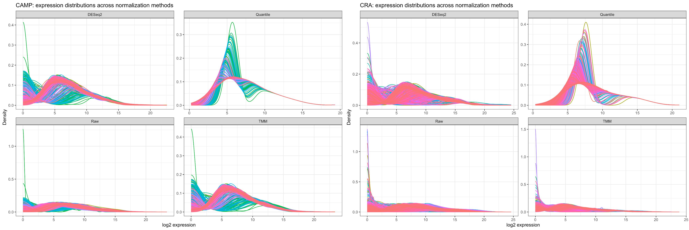
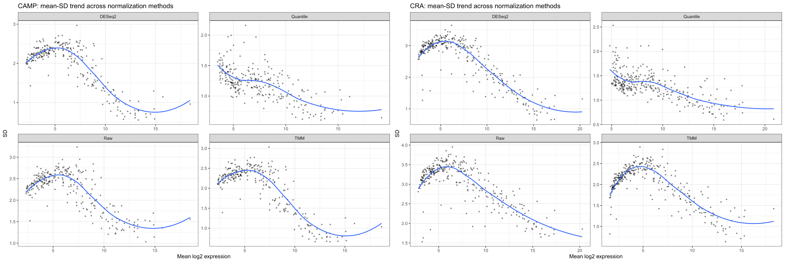
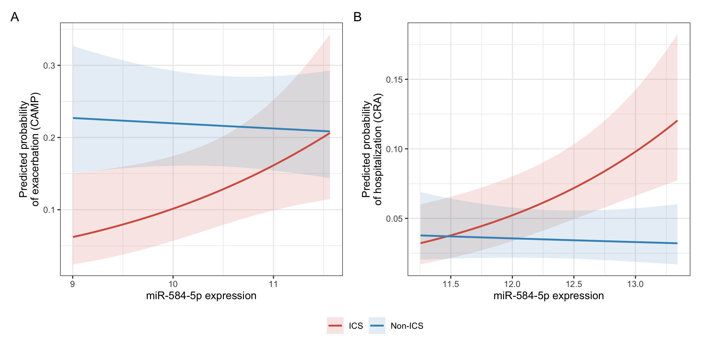

# miRNA × ICS Interaction Analysis in Asthma Cohorts

This repository contains the analysis workflow used to evaluate whether circulating microRNAs modify the effect of inhaled corticosteroid (ICS) therapy on asthma exacerbation risk.

The analysis compares normalization strategies for miRNA sequencing data and performs interaction modeling across two independent cohorts.

---

## Study Overview

Asthma affects millions worldwide, and inhaled corticosteroids (ICS) are the first-line anti-inflammatory therapy. However, approximately 30–40% of patients show suboptimal response.

MicroRNAs (miRNAs) regulate post-transcriptional gene expression and influence inflammatory and immune pathways relevant to asthma biology.

This project investigates whether circulating miRNAs **modify the treatment effect of ICS on exacerbation risk**.

The main statistical model tested is:

Exacerbation ~ ICS × miRNA expression

Analyses were conducted in two cohorts:

- **CAMP cohort** as discovery
- **GACRS cohort** as replication

---

## Workflow

The analysis pipeline includes the following steps, from expression preprocessing to genetic regulation and mechanistic interpretation:

### 1. Data preprocessing

- miRNA count filtering
- sample alignment with phenotype data

### 2. Normalization comparison

Normalization methods evaluated:

- Raw counts (log transformed)
- **TMM normalization (edgeR)**
- **DESeq2 median-of-ratios**
- **Quantile normalization**

Quality control plots generated:

- Expression density plots
- PCA visualization
- Relative Log Expression (RLE) plots
- Mean–variance (mean–SD) trends
- Cross-method correlation plots

*Normalization QC showed that quantile normalization improved cross-sample distribution alignment and reduced mean-SD dependence compared with raw, TMM, and DESeq2-normalized values. Mean–SD trends further show reduced variance dependence on expression level after quantile normalization.*

### 3. Demographic summaries

- Continuous variables (t-tests)
- Categorical variables (chi-square tests)
- Violin plots by treatment group

### 4. Interaction analysis and replication

For each miRNA:
Outcome ~ ICS * miRNA expression + covariates

- Interaction models fitted in CAMP (discovery)
- Replication tested in CRA cohort
- Effect estimates include:
  - interaction odds ratios
  - stratified effects by treatment group
  - multiple testing correction (FDR)

For sensitivity analysis, we evaluated models using an ordinal representation of excerbation severity in CAMP cohort:
exacerbation_ordered ~ ICS * miRNA expression + covariates

### 5. Meta-analysis of replicated signals

For miRNAs showing consistent effects across cohorts (e.g., miR-584-5p), results were combined using fixed-effect inverse-variance weighted meta-analysis.

- Combined effect sizes were calculated on the log(OR) scale
- Standard errors were used for weighting
- Sensitivity analyses included Fisher’s and Stouffer’s methods for p-value combination

This step provides a unified estimate of the interaction effect across cohorts.

### 6. cis-miR-QTL analysis

Evaluated whether genetic variants in the cis-region of miR-584 regulate its expression.

Model:

miRNA expression ~ SNP + covariates (age, sex, PCs)

Key steps:

- Extracted SNPs within cis-window around miR-584 locus
- Performed association testing for each SNP
- Identified top associated variants (e.g., rs36047 and nearby loci)
- Assessed linkage disequilibrium (LD) between top SNPs

This analysis links genetic variation to miRNA regulation, enabling downstream causal interpretation of treatment-response signals (e.g., rs36047 → miR-584-5p → exacerbation risk).

---

### 7. miRNA target analysis and pathway context

Identified biologically relevant targets of miR-584-5p and evaluated their role in glucocorticoid-response pathways.

Steps:

- Queried experimentally validated miR-584-5p targets using curated databases
- Performed targeted lookup for genes involved in glucocorticoid response
- Evaluated pathway context of these genes using Reactome

*This focused analysis highlighted immune and signaling pathways relevant to asthma and corticosteroid response, including cytokine signaling, MAPK/ERK signaling, PI3K signaling, and nuclear receptor pathways.*

---

### 8. Mediation analysis

Tested whether miR-584-5p mediates the effect of genetic variants on exacerbation risk.

Framework:

SNP → miRNA → Exacerbation

Steps:

- Fit SNP → miRNA model (cis-miR-QTL)
- Fit miRNA → outcome model with ICS interaction
- Performed mediation analysis to estimate indirect effects
- Evaluated mediation under treatment stratification (ICS vs non-ICS)

This provides insight into potential mechanistic pathways linking genotype to clinical outcome.

---

## Reproducibility

Package versions used for the analysis can be reproduced using:

- Rscript run_all.R
- Rscript scripts/session_info.R

---

## Key Result

miR-584-5p emerged as a candidate treatment-effect modifier of ICS-associated exacerbation risk. In the primary interaction models, higher miR-584-5p expression was associated with increased exacerbation risk among ICS-treated subjects, with weaker or absent association in non-ICS subjects.

In an ordinal proportional-odds sensitivity model, the ICS × miR-584-5p interaction remained nominally significant and directionally consistent (OR = 1.70, Wald p = 0.048), supporting robustness to outcome definition.

*Adjusted predicted probability curves for miR-584-5p in CAMP and CRA. Predictions were generated from covariate-adjusted interaction models, holding numeric covariates at their mean and categorical covariates at reference levels.*

Follow-up analyses showed that miR-584-5p is genetically regulated (cis-miR-QTL) and targets genes enriched in glucocorticoid-response pathways, supporting a biologically plausible mechanism for ICS response heterogeneity.

-----

## Data Availability

Due to cohort data use agreements and patient privacy restrictions raw data are not stored in this repository.

---

## What this project demonstrates

- End-to-end pharmacogenomic analysis: from miRNA expression → treatment interaction → genetic regulation → biological interpretation
- Identification of treatment-effect modifiers using interaction models (ICS × miRNA)
- Cross-cohort validation and meta-analysis for robust signal prioritization
- Connecting genetic variation to treatment-response mechanisms through miRNA regulation (cis-miR-QTL)
- Mechanistic follow-up using miRNA target mapping and pathway enrichment
- Sensitivity analysis across outcome definitions (binary and ordinal models)
- Reproducible and modular workflow for multi-cohort bioinformatics analysis