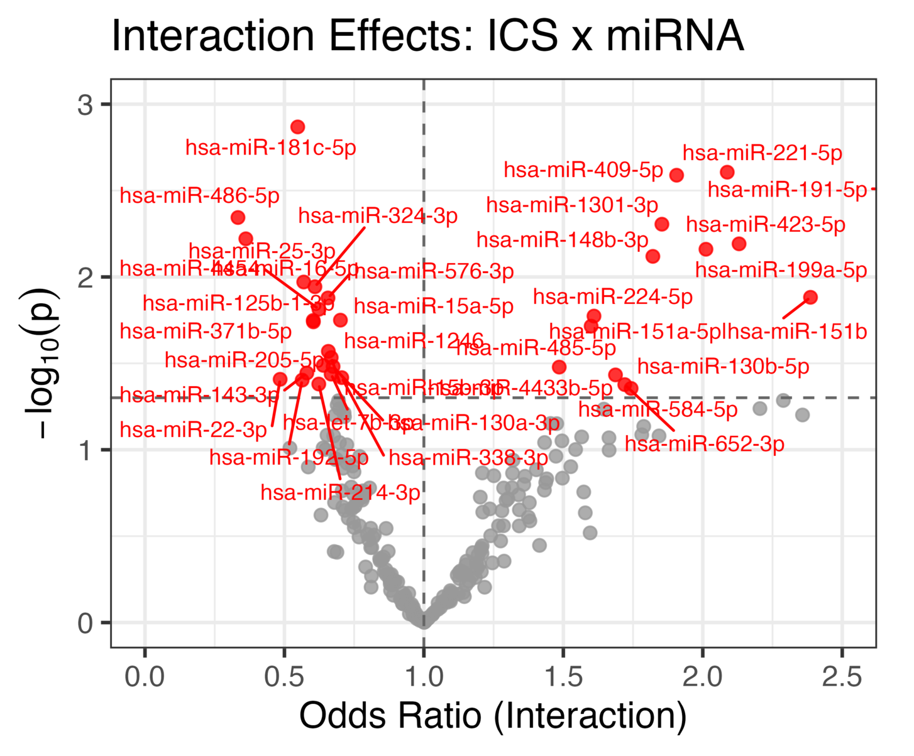
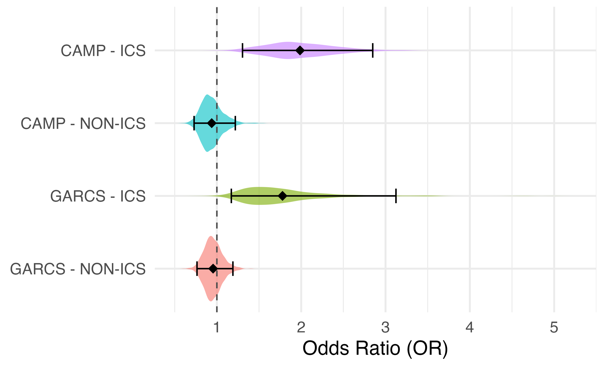

# miRNA × ICS Interaction Analysis in Asthma Cohorts

This repository contains the analysis workflow used to evaluate whether circulating microRNAs modify the effect of inhaled corticosteroid (ICS) therapy on asthma exacerbation risk.

The analysis compares normalization strategies for miRNA sequencing data and performs interaction modeling across two independent cohorts.

---

## Study Overview

Asthma affects millions worldwide, and inhaled corticosteroids (ICS) are the first-line anti-inflammatory therapy. However, approximately 30–40% of patients show suboptimal response.

MicroRNAs (miRNAs) regulate post-transcriptional gene expression and influence inflammatory and immune pathways relevant to asthma biology.

This project investigates whether circulating miRNAs **modify the treatment effect of ICS on exacerbation risk**.

The main statistical model tested is:

Exacerbation ~ ICS × miRNA expression

Analyses were conducted in two cohorts:

- **CAMP cohort** as discovery
- **GACRS cohort** as replication

---

## Workflow

The analysis pipeline includes the following steps, from expression preprocessing to genetic regulation and mechanistic interpretation:

### 1. Data preprocessing

- miRNA count filtering
- sample alignment with phenotype data

### 2. Normalization comparison

Normalization methods evaluated:

- Raw counts (log transformed)
- **TMM normalization (edgeR)**
- **DESeq2 median-of-ratios**
- **Quantile normalization**

Quality control plots generated:

- Expression density plots
- PCA visualization
- Relative Log Expression (RLE) plots
- Mean–variance (mean–SD) trends
- Cross-method correlation plots

### 3. Demographic summaries

- Continuous variables (t-tests)
- Categorical variables (chi-square tests)
- Violin plots by treatment group

### 4. Interaction analysis

For each miRNA:
Outcome ~ ICS * miRNA expression

Models produce:

- interaction odds ratios
- stratified odds ratios
- adjusted p-values (FDR)

### 5. Follow-up analysis

Focused analysis for **miR-584-5p** including downstream genetic and mechanistic follow-up:

- predicted probability curves
- AUC evaluation
- stratified treatment analysis

### 6. cis-miR-QTL analysis

Evaluated whether genetic variants in the cis-region of miR-584 regulate its expression.

Model:

miRNA expression ~ SNP + covariates (age, sex, PCs)

Key steps:

- Extracted SNPs within cis-window around miR-584 locus
- Performed association testing for each SNP
- Identified top associated variants (e.g., rs36047 and nearby loci)
- Assessed linkage disequilibrium (LD) between top SNPs

This analysis connects genetic variation to miRNA regulation.

---

### 7. Mediation analysis

Tested whether miR-584-5p mediates the effect of genetic variants on exacerbation risk.

Framework:

SNP → miRNA → Exacerbation

Steps:

- Fit SNP → miRNA model (cis-miR-QTL)
- Fit miRNA → outcome model with ICS interaction
- Performed mediation analysis to estimate indirect effects
- Evaluated mediation under treatment stratification (ICS vs non-ICS)

This provides insight into potential mechanistic pathways linking genotype to clinical outcome.

---

### 8. miRNA target analysis and pathway enrichment

Identified downstream gene targets of miR-584-5p and evaluated biological pathways.

Steps:

- Queried validated and predicted targets using multiMiR
- Combined results across databases (miRTarBase, TarBase, miRecords)
- Performed pathway enrichment analysis (Reactome, GO)

Key outputs:

- List of validated gene targets
- Enriched pathways related to immune signaling and inflammation

---

## Reproducibility

Package versions used for the analysis can be reproduced using:

- Rscript run_all.R
- Rscript scripts/session_info.R

---

## Key Result

miR-584-5p emerged as a candidate modifier of inhaled corticosteroid response. Interaction modeling identified significant ICS × miRNA effects, with miR-584-5p showing stronger association with asthma outcomes in ICS-treated subjects than in non-ICS subjects.

*Interaction analysis across candidate miRNAs. miR-584-5p was among the strongest ICS × miRNA interaction signals.*

*Estimated effect of miR-584-5p stratified by cohort and ICS exposure, showing stronger association in ICS-treated individuals.*

-----

## Data Availability

Due to cohort data use agreements and patient privacy restrictions raw data are not stored in this repository.

---

## What this project demonstrates

- End-to-end modeling of treatment response using statistical and machine learning approaches 
- Experience with workflows: normalization, modeling, genetic association, and pathway analysis  
- Application of interaction models to study treatment response (ICS × miRNA)  
- Integration of diverse data: miRNA expression, genotype (cis-miR-QTL), and clinical outcomes  
- Use of mediation analysis to explore potential biological mechanisms  
- Focus on reproducibility and well-structured analytical workflows  

